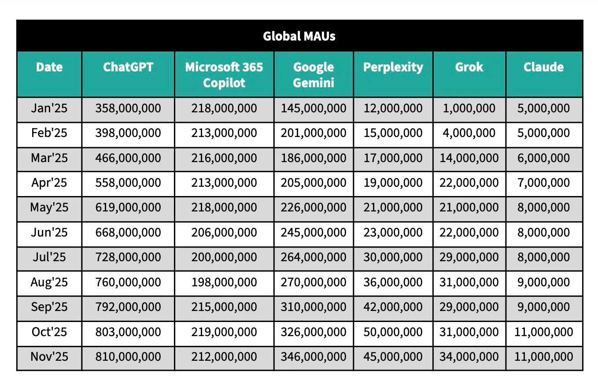

Today one of my colleagues sent me this [TechCrunch article](https://techcrunch.com/2025/12/05/chatgpts-user-growth-has-slowed-report-finds/) about the monthly active usage of popular GPTs and a screenshot from it.

I decided to make a better version to let the data shine.

<noscript></noscript><object class='tableauViz'  style='display:none;'><param name='host_url' value='https%3A%2F%2Fpublic.tableau.com%2F' /> <param name='embed_code_version' value='3' /> <param name='site_root' value='' /><param name='name' value='GPTMAUSensorTower&#47;GPTMAUSensorTower' /><param name='tabs' value='no' /><param name='toolbar' value='yes' /><param name='static_image' value='https:&#47;&#47;public.tableau.com&#47;static&#47;images&#47;GP&#47;GPTMAUSensorTower&#47;GPTMAUSensorTower&#47;1.png' /> <param name='animate_transition' value='yes' /><param name='display_static_image' value='yes' /><param name='display_spinner' value='yes' /><param name='display_overlay' value='yes' /><param name='display_count' value='yes' /><param name='language' value='en-US' /></object>
                

Nothing fancy, just simple line charts and a month-over-month table, took me 15 minutes. But what a huge difference!

### How did I do it?
- I visualized the bigger picture with a line chart and used an old trick with a max(date) reference line to extend space for mark labels — it’s a simple way to avoid using legends and keep things clear.
- I did the same for those competing in the Tier 2 league.
- I highlighted the month-over-month difference using quick table calculations and hid the first month.

Explore more of my Tableau Projects [here](https://public.tableau.com/app/profile/vitaliy.kovalev)
