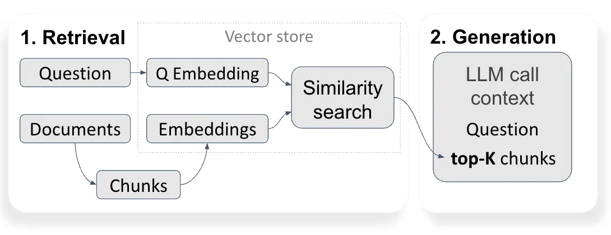
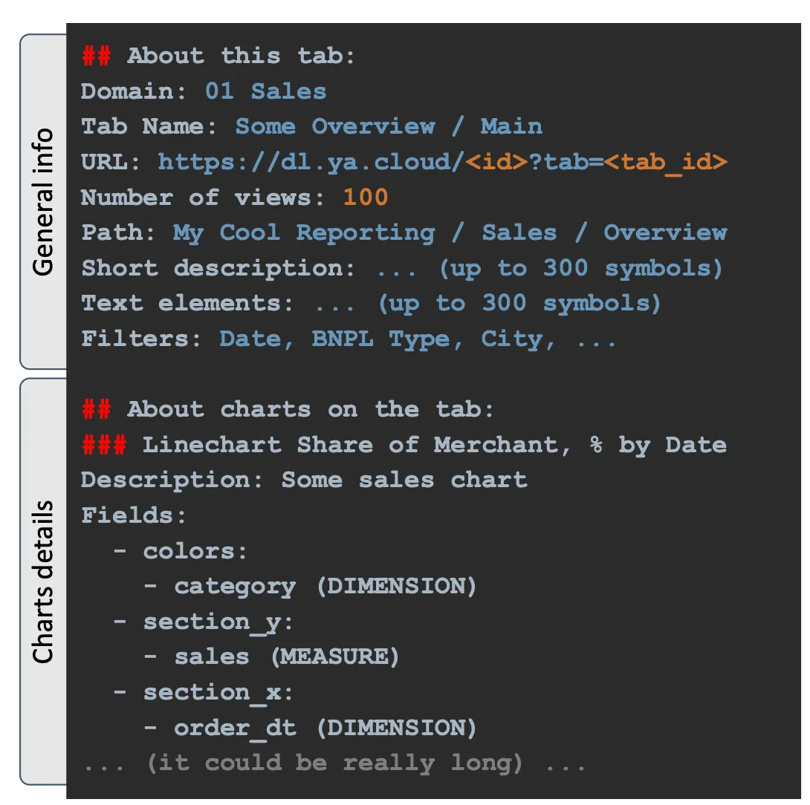
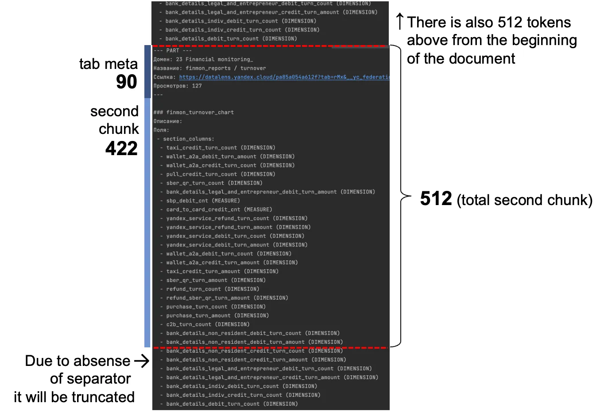
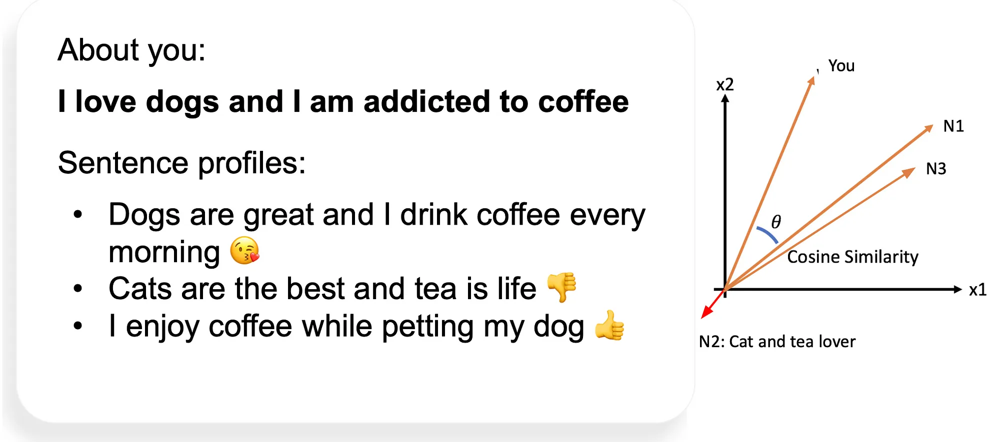
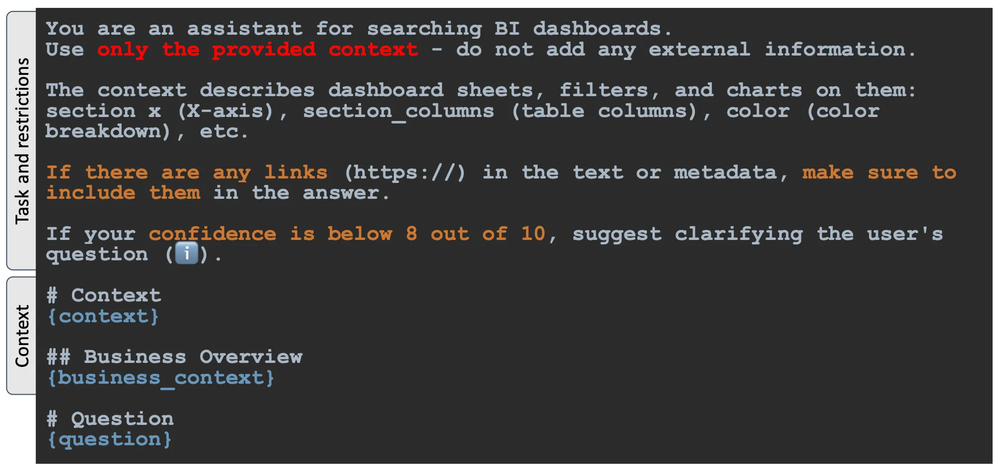
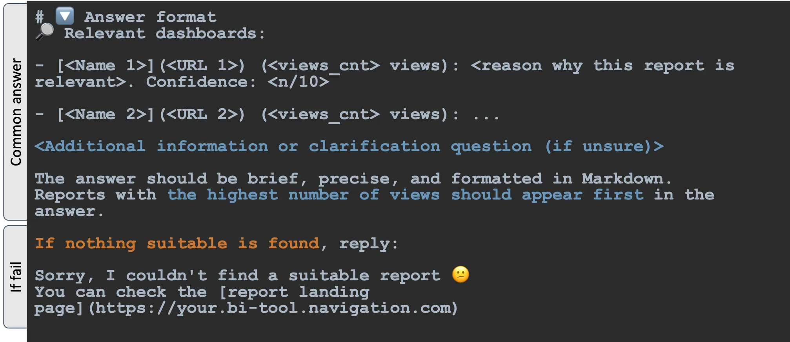
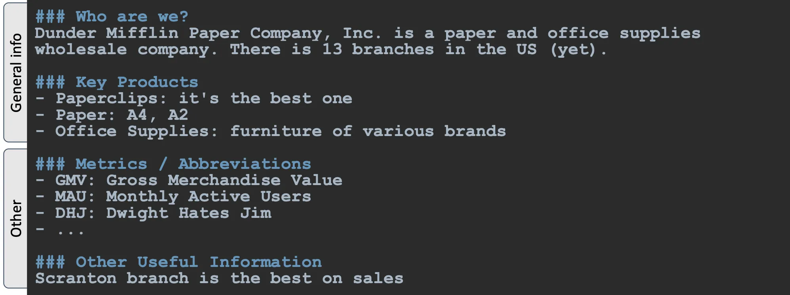


Disclaimer: Models and their limits evolve, but the core approach in this article should remain relevant. Always double-check the current model landscape before implementing.


🎥 Here’s a video of me trying to explain all this at the last Serbian Tableau User Group.



---

## What are the prerequisites for using this approach?
- The company’s BI tool has hundreds of reports and continues to grow
- The company is growing fast, with new employees and new dashboards being added
- There is a lack of business intelligence culture among dashboard creators, as many reports lack descriptions, tags, and keywords
- The process of dashboard creation is both rapid and decentralized, allowing for faster development but also introducing challenges in maintaining consistency
- Documentation exists in-place, meaning small texts near charts or elements next to dashboard filters that explain metrics

## What is the problem?
End users struggle to find useful information quickly. This typically happens because of BI tool limitations:

- Poor search experience, with no “search by meaning” functionality
- Vendors often sell search improvements as add-ons instead of improving them for free, leading to significant additional costs for extended licenses
- A bias toward English in BI tool search functionality

All of this leads to new ad-hoc tasks for analysts and worsens data literacy across the company. Archiving outdated dashboards may help, but it’s often not enough.

## What is RAG?
**RAG (Retrieval-Augmented Generation)** is an approach that helps an LLM reduce hallucinations by retrieving information from document storage instead of relying solely on its internal knowledge.

> RAG **mitigates hallucinations** but **doesn’t eliminate** them completely: always validate outputs



There is basically 2 steps to implement RAG:

1. **Retrival.** **Question** and **documents** will be converted into a **vectors (embeddings)** and then **similarity search** will be excecuted. Basic search algorithm is **cosine similarity** — a metric that measures how closely two vectors “point” in the same direction. The closer the directions, the more similar the meanings.
2. **Generation.** The **k** most relevant documents and the initial question are passed to the model for answer **generation** (along with a custom **prompt**).

## Why LLM is better than basic BI search?
Most BI tools I’ve seen in production use a simple search that matches only keywords. In some cases, there are no search capabilities at all.

LLM, on the other hand, understands meaning — even with typos, missing tags, or vague questions — making it far more reliable for the complexity and unpredictability of BI environments.

## What data and prompt do you need?

### 1. Reports metadata
A simple text or markdown document that contains the report page content and some metadata, which will be useful later when splitting it into pieces.

DataLens, my main BI system, provides an API that I use to gather information about dashboards, tabs, and charts on those tabs.



Metadata for this document:
```json
"meta": {
      "domain": "01 Sales",
      "tab_name": "Some Overview / Main",
      "url": "https://datalens.yandex.cloud/<dash_id>?tab=<tab_id>",
      "number_of_views": 100
}
```
### 2. Any LLM API
Open-source models can be very effective. In my production I use an internally hosted [DeepSeek V3](https://github.com/deepseek-ai/DeepSeek-V3) API, but you might prefer **Mistral** or the **OpenAI API** if your dashboard metadata is not protected by an NDA.

### 3. Some general business overview
Just a short text containing information about your business to provide additional context to the LLM. Keep it as brief as possible.

```md
### Who are we?
Dunder Mifflin Paper Company, Inc. is a paper and office supplies 
wholesale company. There is 13 branches in the US (yet).

### Key Products
- Paperclips: it's the best one
- Paper: A4, A2
- Office Supplies: furniture of various brands
- ...

### Metrics / Abbriviations
- GMV: Gross Merchandise Value
- MAU: Monthly Active Users
- DHJ: Dwight Hates Jim
- ...

### Other Useful Information
- Scranton branch is the best on sales
- ...
```
### 4. Vector database
I use local files and [FAISS](https://github.com/facebookresearch/faiss), but for production environments with many users, you could use a variety of compatible [vector databases](https://python.langchain.com/api_reference/community/vectorstores.html).

### 5. Metadata about user / company’s intranet API (optional)
If you have intranet portal (such as SharePoint) that list users and the department hierarchy, this information can help improve context-based search and support final decision-making.

### 6. Any interface to hand over results to the end users (optional)
In my solution I use a Telegram bot (it’s widely used messenger within my company), but you can plug results into whatever tool your users prefer. In this article and GitHub repository I use examples of CLI-tools, but then you could easily adapt it to any other interface.

")

## Creating a vectorstore
Now let’s put it all together!
To build an MVP for search functionality, the first step is to create a **vector store** using the **Reports Metadata**. The goal of this step is to convert our metadata about dashboards into vectors, also known as embeddings.

There are many embedding models available, but a good starting point is [intfloat/multilingual-e5-base](https://huggingface.co/intfloat/multilingual-e5-base) — it’s CPU-optimized, supports multiple languages, and handles up to **512** tokens, making it a solid choice for processing longer text blocks.

However, if you look at the average metadata report document, it’s usually much larger than 512 tokens.

To address this, it is necessary to [split documents](https://python.langchain.com/docs/how_to/split_by_token/) into smaller parts that fit within the token limit.

To avoid losing important information and to improve the quality of vector search, headers (`## ` and `### `) can be used as natural split points.

Additionally, for every chunk text that does not start with a `## About this tab: ` (which marks the beginning of the document and contains general metadata), extra metadata prepared earlier during the first step of data preparation will be attached.

```md
--- PART ---
Domain: <Domain of the original Document>
Tab Name: <Tab Name of the original Document>
URL: <URL of the original Document>
Number of views: <Number of views of the original Document>
---
<chunk content>
```

Here is a simple example of the document (you could have thousands of them):
```json
{
    "meta": {
      "domain": "01 Sales",
      "tab_name": "Regional Dynamics",
      "url": "https://dl.ya.cloud/abc?tab=100",
      "number_of_views": 278
    },
    "md": "## About this tab:\nDomain: 01 Sales\nTab Name: Regional Dynamics..."
}
```
Here is what the creation of the local vector storage looks like:


import json
from langchain.schema import Document
from langchain.text_splitter import RecursiveCharacterTextSplitter
from langchain_community.vectorstores import FAISS
from langchain_huggingface import HuggingFaceEmbeddings
from transformers import AutoTokenizer
import hashlib


def convert(
        base: list[dict]
) -> list[Document]:
    """
    Basic function that converts text to langchain.Documents
    """
    docs = []
    for row in base:
        text = row.get('md')
        metadata = row.get('meta')
        docs.append(Document(page_content=text, metadata=metadata))
    return docs


def enrich_with_metadata(doc: Document) -> Document:
    """
    Function that add additional metadata to the document chunk
    """
    meta = doc.metadata
    if "source" in meta and "start_index" in meta:
        meta["uid"] = f"{meta['source']}:{meta['start_index']}"
    else:
        meta["uid"] = hashlib.md5(
            doc.page_content.encode("utf-8")
        ).hexdigest()

    meta_text = '\n'.join([
        "--- PART ---",
        f"Domain: {doc.metadata.get('domain', '')}",
        f"Tab Name: {doc.metadata.get('tab_name', '-')}",
        f"URL: {doc.metadata.get('url', '-')}",
        f"Number of views: {doc.metadata.get('number_of_views', 0)}",
        '---'
    ]).strip()
    if '## About this tab:' in doc.page_content:
        concatenation = doc.page_content
    else:
        concatenation = meta_text + "\n" + doc.page_content
    return Document(
        page_content=concatenation,
        metadata=meta
    )

# Launch parameters
metadata_path='./docs' # Path to the folder with test metadata
hf_embedding_name='intfloat/multilingual-e5-base' # Model name
vectorstore_output="./rag # Where to save FAISS vector base
chunk_size=512 # Embedding model limitation (depends on model)
add_meta_size=90 # Additional meta tokens cnt before the next chunk

# Step 1: Getting base of documents and metadata
base = []

for filename in os.listdir(metadata_path):
    if filename.endswith(".json"):
        file_path = os.path.join(metadata_path, filename)
        with open(file_path, "r", encoding="utf-8") as f:
            try:
                base.append(json.load(f))
            except json.JSONDecodeError as e:
                print(f"Error in file {filename}: {e}")

docs = convert(base)

# Step 2: Splitting documents and enriching chunks with additional meta
print(f"Got {len(docs)} documents. Splitting...")
tokenizer = AutoTokenizer.from_pretrained(hf_embedding_name)
splitter = RecursiveCharacterTextSplitter.from_huggingface_tokenizer(
    tokenizer,
    chunk_size=int(chunk_size - add_meta_size),
    chunk_overlap=0,
    separators=["\n## ", "\n### "],
    strip_whitespace=True,
    add_start_index=True,
    keep_separator="start"
)
chunks = splitter.split_documents(docs)

chunks = [enrich_with_metadata(chunk) for chunk in chunks]
print(f"🔪 Split into {len(chunks)} chunks")

too_big_details = []

for doc in chunks:
    if len(tokenizer.encode(doc.page_content)) > chunk_size:
        too_big_details.append(
            f"{doc.metadata.get('url')}: {len(doc.page_content)}" 
            f" / {chunk_size}"
        )

too_big_cnt = len(too_big_details)

if too_big_cnt > 0:
    print(f"🔪 {round(float(too_big_cnt / len(chunks)) * 100, 2)}% "
          f"({too_big_cnt} / {len(chunks)}) chunks is too big "
          f"for context of {chunk_size} tokens!")
    print("🔪 Check those dashboard tabs: ")
    print('\n'.join(list(set(too_big_details))))

# Step 3: Vectorstore creation
embedding_model = HuggingFaceEmbeddings(
    model_name=hf_embedding_name,
    encode_kwargs={
        "normalize_embeddings": True
    }
)
vectorstore = FAISS.from_documents(chunks, embedding_model)
vectorstore.save_local(vectorstore_output)



Now take a closer look at **step 2** in the code. As you can see, I used `chunk_size` of `512 - 90 = 422` tokens and a `chunk_overlap` of `0` tokens. Why?



Since every extra metadata block adds about **90** tokens (you can check this using `transformers.AutoTokenizer`), I needed to reduce the size of every chunk starting from second chunk to stay within the limit for the main text content.

This setup should fit the embedding model’s limit of **512** tokens. However, because metadata can sometimes be messy, in **step 4**, I checked the quality of the split (the percentage of chunks that would be truncated due to the model’s limits). To reduce this number, you could use other separators and split long texts into parts. In my case, **1%** of the chunks were larger than **512** tokens. This means that in those chunks, the context was truncated.

## Now you have vector storage. What’s next?
Let’s build an MVP of the reply engine. There are two more things needed: a good **prompt** for generation part and the **vector store retriever**.

Now let’s take a closer look at the **retriever** code:

import os
from jinja2 import Environment, FileSystemLoader
from langchain.chains.combine_documents import \
    create_stuff_documents_chain
from langchain_openai import ChatOpenAI
from langchain_community.vectorstores import FAISS
from langchain_core.prompts import PromptTemplate
from langchain_huggingface import HuggingFaceEmbeddings

os.environ["TOKENIZERS_PARALLELISM"] = "false"


def render_template(
    env: Environment,
    template_name: str,
    **kwargs
) -> str:
    template = env.get_template(template_name)
    return template.render(**kwargs)


# Launch parameters
question = 'Which report contains table with sales?'
retriever_k = 40
vectorstore: './rag'
prompt_location = './'
hf_embedding_name = 'intfloat/multilingual-e5-base'

# Jinja2 Environment to load the prompt text and expand 
# it with additional context later on
jinja_loader = FileSystemLoader(prompt_location)
jinja_env = Environment(loader=jinja_loader)

# Same model that have been used in vectorstore creation
embedding_model = HuggingFaceEmbeddings(
    model_name=hf_embedding_name,
    encode_kwargs={"normalize_embeddings": True}
)

# 1. Similarity search stage
db = FAISS.load_local(
    folder_path=vectorstore,
    embeddings=embedding_model,
    allow_dangerous_deserialization=True
)

retriever = db.as_retriever(
    search_kwargs={"k": retriever_k}
)

unique_docs = retriever.invoke(question)

print(f"Unique docs cnt: {len(unique_docs)}")

# 2. Generation stage
# Initializing the llm api (temperature=0 means that 
# gpt would be less creative in the answers)
llm = ChatOpenAI(
    model="gpt-4o",
    openai_api_key=os.environ.get('OPENAI_API_KEY', ''),
    temperature=0.0
)

# Reading prompt
prompt = render_template(
    env=jinja_env,
    template_name='prompt.md',
)

# Passing our k documents to the prompt
final_prompt = PromptTemplate(
    input_variables=["context", "question"],
    template=prompt
)

# LLM call
chain = create_stuff_documents_chain(
    llm,
    final_prompt,
    document_variable_name="context"
)
result = chain.invoke(
    {
        "question": question,
        "context": unique_docs
    }
)

# 3. Result
print(f"\n{result}\n")



Let’s break this down:

First, I initialized the `HuggingFaceEmbeddings` class to define which embedding model I will use during the retrieval process.

One important detail: `encode_kwargs={"normalize_embeddings": True}`. I used this because **FAISS** performs better on normalized vectors.

Then, I created the FAISS database with `allow_dangerous_deserialization=True`, since Pickle files could contain malware if tampered with. But since I created the files myself, I trust them.

Then I invoke the retriever to use cosine similarity to find the most relevant docs.

### What is cosine similarity?
Let’s say you want to make a Tinder for sentences: with cosine similarity it would be a piece of cake to find a match!

Let’s say you’re dog lover and would kill for coffee. You have those profiles in the database: 1,2,3. If you apply this algorithm it would say that 1 and 3 is the high match, and number 2 is completely off.



> If you imagine your user question and your chunks as the coordinates of meaning in multidimensional space then you could just compare the align and direction of those vectors to find the most similar.

Now let’s talk about `search_kwargs.k` parameter.

This parameter controls the number of documents the retriever will return after finding results cosine-similar to the user’s query.

Since I use in code example **gpt-4o** the context window is **128k** tokens (up to **300** chunks), but in production I use **DeepSeek V3**, where the context window is only [64 000](https://api-docs.deepseek.com/quick_start/pricing) tokens, meaning that I could theoretically pass around **150** document chunks.

However, keep in mind you also need room for the system prompt — the more system context you add, the fewer document chunks you can pass without hitting limits.

You should also remember:
- Higher k → more documents → better quality, but
- Higher k → longer execution time.

So, you’ll need to find a balance. I recommend starting with k = 40 and adjusting based on your needs.

#### How to measure quality of retriever?
The basic goal for you before launch is to optimize the recall and precision metrics. It’s basically the share of successful searches.

**Recall = K<sub>found</sub> / K<sub>relevant</sub>**

**Precision = K<sub>found</sub> / K<sub>retrieved</sub>**

To calculate those metrics you could use simple dataset with 50 different questions and id’s of the most relevant chunks that should be found by the algorithm. Then you just run the search 50 times and compare chunks that were found and your relevant chunks.

| **Question**                 | **Relevant documents** |
|------------------------------|------------------------|
| Find me a report about sales | [1000, 1001, 1002]     |
| Paperclips profit            | [2004, 100]            |

Then you could make this dataset bigger and more similar to your users questions.

### Generation part
After that, I initialized LLM and pass those docs to the context of the LLM API call.

As for the prompt, I created this version (you can also expand it with additional context like a business overview or domain descriptions):




You can use  [my code example](https://github.com/vitaliy-kovalev/dashboards-rag-example/blob/main/ask_me_anything.py) and simply run it as CLI:
```bash
python3 -m ask_me_anything -q 'Find me a report about sales'
...
🔎 Relevant dashboards:

- [Regional Dynamics](https://dl.ya.cloud/abc?tab=100) (278 views): 
Contains a table with sales data, including dimensions like region, city, 
and product, and measures such as GMV, sales, and average check. 
Confidence: 9/10
```
## Some Tips
- **Pre-filter irrelevant metadata** (outdated dashboards, somewhat from sandbox folder, etc.) to improve search efficiency.
- **Sort your documents** based on relevance by creating a custom retriever class.
- Consider your metadata and your user **language** when selecting the **embedding** model.
- To improve the quality of the retriever you could use **re-phrases** of the initial question and advanced algorithms (MMR and RRF) to make the **recall** better.
- Try to give your end users MVP on early stages: I guarantee they will surprise you with their questions :)

---

Don’t hesitate to ask follow-up questions or reach out if you need advice.

Here is a  [GitHub repository](https://github.com/vitaliy-kovalev/dashboards-rag-example) with all code and examples to start with.

**Happy coding! 🚀**