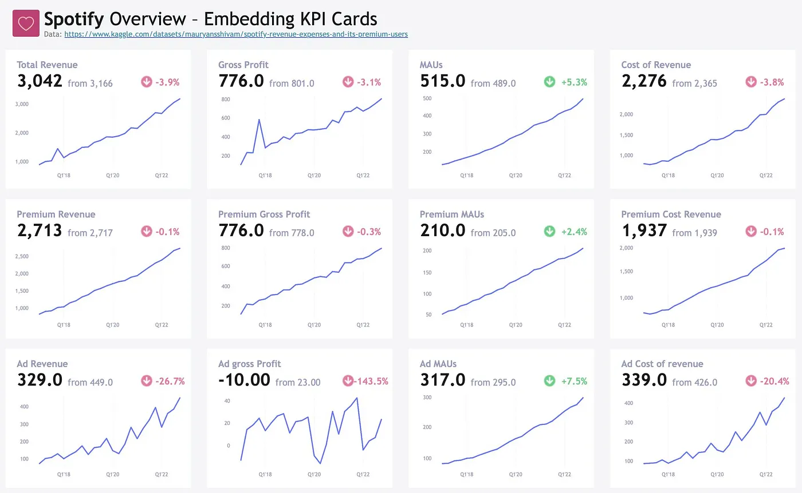
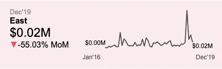
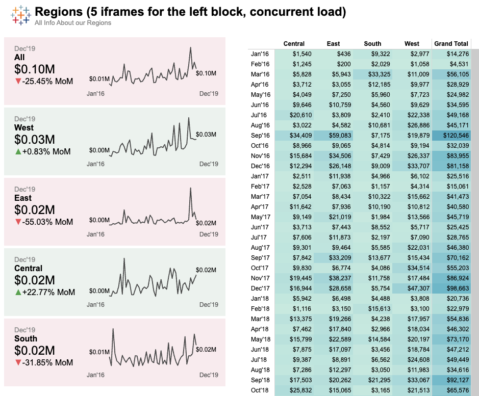
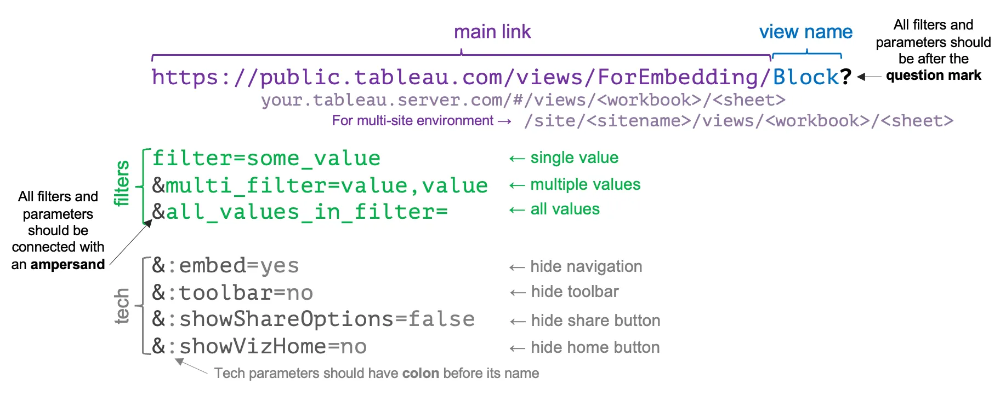

[Anastasiya Kuznetsova](https://nastengraph.substack.com/) mentioned my old [TUG presentation](https://youtu.be/Z6AYX4a9uR4?t=2717) (in Russian) where I shared a technique that provides a great way to multiply visuals without needing to recreate them.

> **TL;DR:** Embedding lets you reuse visuals across dashboards. It not only speeds up delivery but also improves load times, as embedded elements load at the same time.

- [🔗 Anastasiya’s example](https://public.tableau.com/app/profile/nastengraph/viz/Spotify_17434979348690/ExampleMainDashboard2)
- [🔗 My old example](https://public.tableau.com/views/EmbeddingExamples/Ex1RepeatableBlockwEmbedding) with comparison to default technique

## How to do it?
There are basically two ways to embed something in Tableau:
- [Basic](https://help.tableau.com/current/pro/desktop/en-us/embed.htm)
- [JS API](https://help.tableau.com/current/api/embedding_api/en-us/index.html) | [Samples](https://github.com/tableau/js-api-samples)

The JS API is for someone who wants to embed Tableau views and dashboards into another product, like a web page or application.

**Here, I will use the first method, assuming that we are able to embed one dashboard into another dashboard.**

First, let’s create a view or a dashboard that we plan to embed. It could be any type of visualisation. I created a [KPI card](https://public.tableau.com/views/ForEmbedding/Block) with some additional context for my users and added a parameter to switch between regions:

Then I created a proper link and used it in the Web Page objects on the [dashboard](https://public.tableau.com/views/EmbeddingExamples/Ex1RepeatableBlockwEmbedding).

## Details
Let’s break it down using this example:
`https://your.tableau.server.com/#/views/ForEmbedding/Block?filter=some_value&multi_filter=value,value&all_values_in_filter=&:embed=yes&:toolbar=no&:showShareOptions=false&:showVizHome=no`

There is some rules on how to create this link:

- Main link should lead to your worksheet on your Tableau Server / Online: `https://your.tableau.server.com/#/views/<workbook>/<sheet>` or `https://your.tableau.server.com/#/site/<sitename>/views/<workbook>/<sheet>` for multi-site environment.
- Tableau Public also compatible but link is slightly different, for example `https://public.tableau.com/views/<workbook>/<sheet>`
- Link should follow [url-encode rules](https://datatracker.ietf.org/doc/html/rfc3986#section-2.1): query should begin with a question mark (`?`), separate the parameters using ampersands (`&`), separate multiple values per parameter using commas (`,`). Also, there is some reserved characters (`,:/?#[]@!$&()*+,;='`). You can pass parameters aliases using `parameter=<parameter_name~na>`.
- To link parameters with each other you can use (`~s0`), for example `Region~s0=Central,West&Category~s0=Furniture,Technology` will be recognised as `"filter sales of Furniture category in Central region and Technology category in the West region"`.

You can find the list of all available tech parameters [here](https://help.tableau.com/current/pro/desktop/en-us/embed_list.htm).

There is some disadvantages of this technique:

- **It does not work well with Tableau Public** — the toolbar stays visible and there’s no way to remove it
- **Continuous filters are painful** — you can only pass values as a list, but you can create custom calculations to handle filtering
- **Safari has a quirk** — adding `16px` to the width fixes the scroll issue
- **You need to encode spaces and other special characters** in filter values (any online URL encoder can handle it)
- Filters aren’t supported inside Stories

Overall, it’s a great feature, so feel free to use it if it fits your needs. Hope that helps you create better solutions for your customers. 

Cheers!
