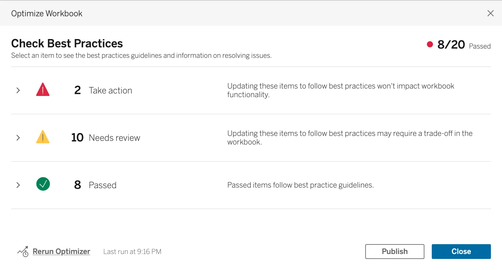
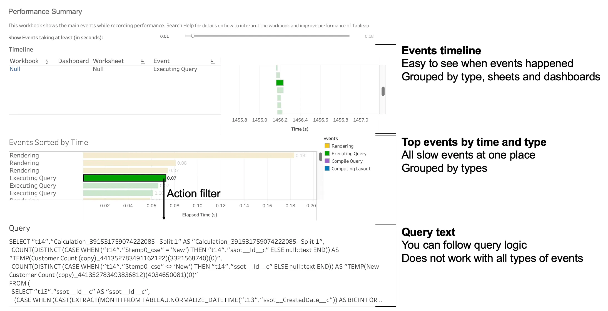
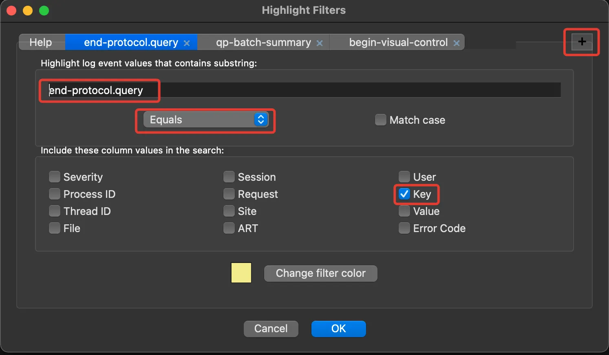
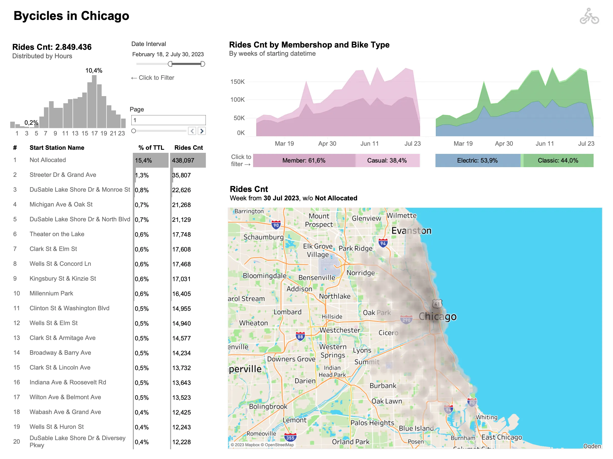
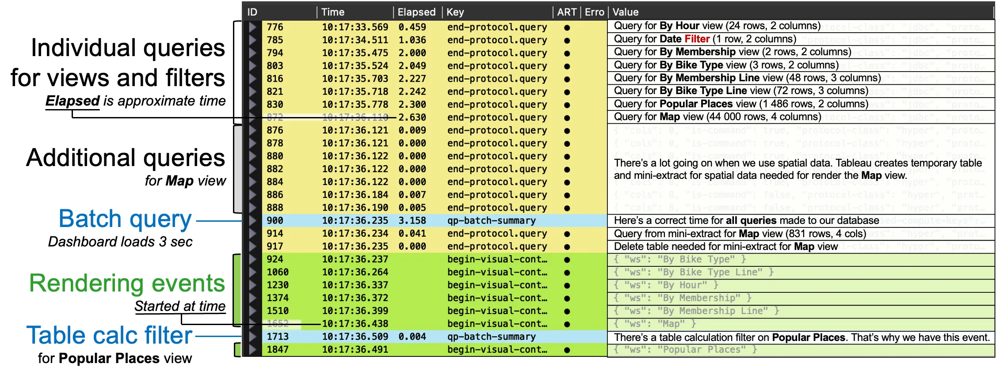
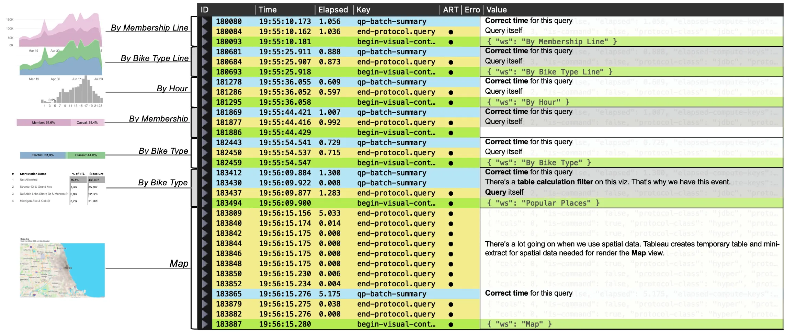
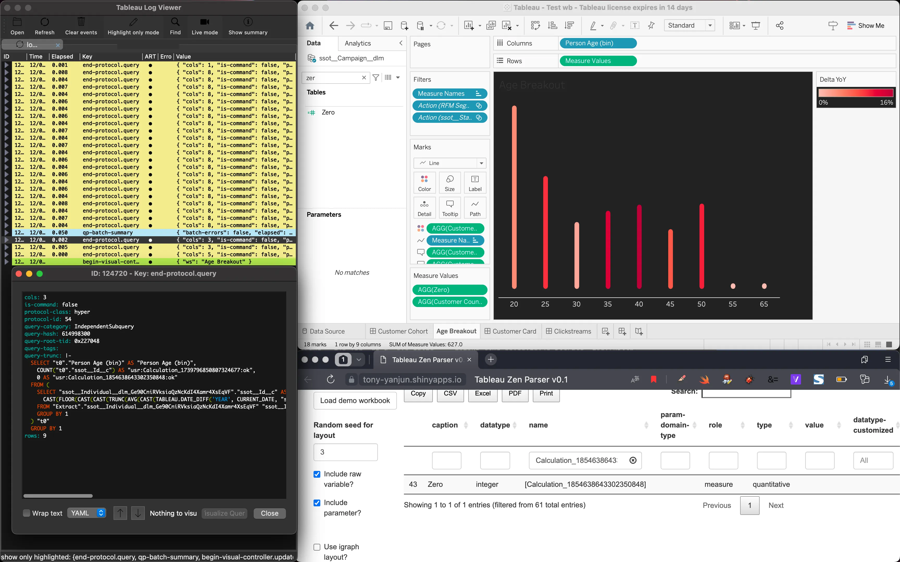

Although Tableau is an easy-to-use drag-and-drop tool it can sometimes be challenging to understand why a report is so slow, particularly when dealing with a live database connection.
The main goal of this article is to guide you through all kinds of optimisation tools and help you considerate which one to use.

## What tools do you have?
You can use **Tableau Optimizer** or **Performance Recording** tools to figure it out, but sometimes these may not be the most effective solutions. Additionally, there is **Tableau Log Viewer**, which I will introduce to you a bit later.
The first tool (**Server → Run Optimizer**) is great when you are trying to find some basic report design problems.



It covers 20 most common mistakes made by workbook creators: too many views on dashboard, unused fields, relative filters, etc. According to this tool one of the factors that making your workbooks slower is live connections:
> Tableau extracts are designed to be as efficient as possible for use with analytics. Using extracts is one of the easiest ways to improve performance due to the data source. Extracts also have many native features for optimization.

However, it always depends on the number of rows and columns you have: sometimes extracts is just not an option: tables with more than 1 billion rows and 200 columns are not so rare these days (hello, big data 😘).

Let’s assume that you don’t have any other issues with the workbook except you couldn’t use extract for some reason.

To find out what’s wrong with our queries you can use another tool: **Performance Recording**

It demands some actions to not mess things up: **you should press the button _before_ you navigate to the dashboard**. Otherwise, Tableau internal cache will affect the results. This is the main reason why you should not run it on Tableau Server (you [can](https://help.tableau.com/current/server/en-us/perf_record_create_server.htm) do it though) and use your local machine instead.


You should always keep in mind that **internet connection speed** and **your machine CPU and RAM current load** could affect the results. Always measure dashboard at least 3–4 times to make final decisions.


## How to run performance recording?

1. Close all unnecessary programs and clear database cache (if your database have one)
2. Open Tableau Desktop
3. Click <kbd>Help</kbd> → <kbd>Settings and Performance</kbd> → <kbd>Run performance recording</kbd>
4. Open workbook you need to measure and navigate through all dashboards and views you want to measure
5. Click <kbd>Help</kbd> → <kbd>Settings and Performance</kbd> → <kbd>Stop performance recording</kbd>

If you have only one dataset and one dashboard you can run performance recording after opening your workbook (steps 3–5). To clear internal Tableau cache click <kbd>Data</kbd> → <kbd>{Your dataset name}</kbd> → <kbd>Refresh</kbd>

When you close Tableau it will also clear all cache workbook has on Tableau side. You can take advantage of this feature as well.

The performance report will be displayed shortly after you stop the recording:



If you want to focus specifically on query optimisations you should pay attention only to the **query execution** events (green events). That’s where the queries can be found.

The downside of the performance recording method is that you have to re-run it after any changes are made on Tableau or the database side. This is when **Tableau log viewer** can be truly helpful.

## How to install Tableau Log Viewer?

Go to [GitHub](https://github.com/tableau/tableau-log-viewer) and download the `.dmg` or `.exe` file from **Releases** page:

<figure>

<figcaption class="text-center">Where can you download TLV app</figcaption>
</figure>

You cannot simply run this tool on MacBooks with arm64 architecture (M1 / M2). To fix that open Terminal and install Rosetta 2:

```bash
softwareupdate --install-rosetta
```

In the process of the installation you should also type `a` and hit <kbd>Enter</kbd>.

<figure>

<figcaption class="text-center">Rosetta installation process</figcaption>
</figure>

Then you should drag **TLV** app to your **Applications** folder, <kbd>right-click</kbd> on that copy and click <kbd>Get Info</kbd>. Check the box <kbd>Open using Rosetta</kbd> and close info window. Also, you should make sure that app doesn’t have `com.apple.quarantine` attribute. To ensure that run this terminal command:

```bash
xattr -dr com.apple.quarantine /Applications/tlv.app
```

Finally, open the app itself. It should work just fine. You can keep this app in Dock and use it like a normal app.

Here is the whole installation process:

<figure>

<figcaption class="text-center">Installation process and how to open log.txt</figcaption>
</figure>

## How to use it?

Once you open the TLV app you should click the <kbd>Open</kbd> button and choose `log.txt` file from your `~/Documents/My Tableau Repository/Logs` folder on macOS or `C:\Users\<user>\Documents\My Tableau Repository\Logs\` on Windows.

Then you will need to click <kbd>Live mode</kbd> button to continue to refresh info from Tableau Desktop.

Another option is to click <kbd>Live capture</kbd> → <kbd>Open log.txt</kbd>

After that you can make some actions in Tableau Desktop and you will see all actions that Tableau does in **TLV** app logs.

I recommend you to use highlight mode available in the menu <kbd>Highlight</kbd> → <kbd>Highlight</kbd>

You can add some filters in this window:

| **Event Name**                              | **Description**                              |
|---------------------------------------------|----------------------------------------------|
| `end-protocol.query`                        | SQL code and duration of single view queries |
| `qp-batch-summary`                          | Time needed to make a batch of requests      |
| `begin-visual-controller.update-sheet`      | View name                                    |
| `end-visual-controller.update-visual-model` | Time needed to render views                  |



You can save those filters <kbd>Highlight</kbd> → <kbd>Save</kbd> and use them on the next use <kbd>Highlight</kbd> → <kbd>Load Filters</kbd>

## How to measure time properly?

You can use technique to eliminate Tableau internal cache similar to what you used when launching **Performance Recording**. Also, you can click <kbd>Data</kbd> → <kbd>{Datasource name}</kbd> → <kbd>Refresh</kbd> to clear the cache for a specific datasource. When you navigate to the dashboard or view **TLV** app will refresh the logs.

I also recommend measuring views twice:
- Click on each view and then clear the cache
- Click on the dashboard with all views combined

The behaviour of the views can vary depend on certain performance optimisation features of the Tableau, like _query fusion_ (combining multiple individual queries into a single combined query) and _join culling_ (simplifying queries by removing unnecessary joins).

## How to read it?

Let’s assume you have this dashboard with 7 visualisations and 1 date filter:



That is what you get if you record how dashboard loads when you open it:



As you can see, there is quite a bit going on! Some queries will run in parallel, limited by your machine’s CPU usage and the number of connections the database can handle simultaneously. Keep in mind that the load time will be approximate.

Furthermore, Tableau handles maps differently from other views: to load them, Tableau creates a temporary extract and stores it in memory to accelerate loading time.

You can also run all views one by one:



Now all views have `qp-batch-summary` event with a relatively more accurate load time than `end-prococol.query` event provides. Additionally, it’s much easier to allocate query to the view. In first case you had to read the query itself to determine it.

Now you can make some changes and view how it affects on performance. Also, you can measure events multiple times without any additional waiting time.

## Ok, there is a bunch of queries but the code is not readable :(

Things like this is common for SQL-code generated by Tableau:

")

There’s another amazing tool [Tableau Zen Parser](https://tony-yanjun.shinyapps.io/Tableau_zen_parser/) made by Tony Liu that can parse all your workbook calculations and their ID’s based on your `*.twb` file.

<figure>

<figcaption class="text-center">How to use Tableau Zen Parser</figcaption>
</figure>

So if you have a lot of calculations and views based on them break your workspace to 3 pieces: **Tableau**, **TLV** and **Zen Parser Results**:



Now you can understand queries a lot easier using Calculated fields table as a dictionary.

## P.S. Tableau Log Viewer works also on Tableau Server!

You can log in to the machine running your Tableau Server and view server logs using **TLV**. These logs can help you debug issues with your integrations or Tableau components. You can find the actual locations of these server logs [here](https://help.tableau.com/current/server-linux/en-us/logs_loc.htm).

Hope those tips and information were helpful. Please feel free to ask any additional questions in the comments section. 

Happy debugging!
