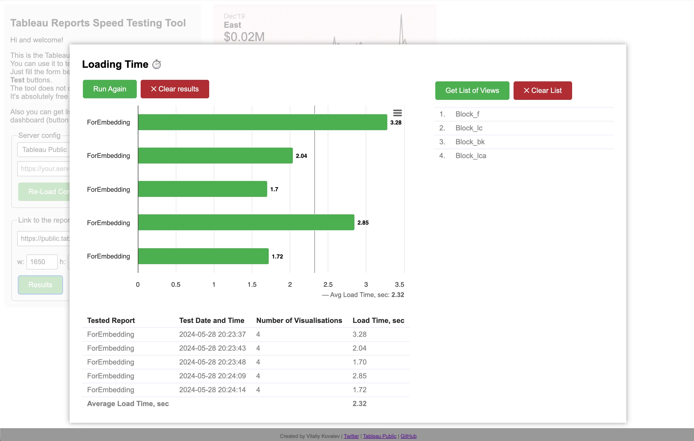

Sometimes, we all get upset when our workbooks are slow. Additionally, it can be quite challenging to measure the exact loading time before and after some changes.

## There is a hard way 😬
If you are using Tableau Server or Tableau Online you can use [Admin Insights](https://help.tableau.com/current/online/en-us/adminview_insights.htm#explore-the-data-sources) to monitor dashboard performance, but it is only available for administrators. Tableau Server admins could also use the internal Tableau database (workgroup) and [Resource Management Tool](https://help.tableau.com/current/server/en-us/rmt-intro.htm) to make report for all users, but it takes some time and skills. Also, it is only daily data refresh available for Tableau Online. If you want to measure the difference after workbook changes keep in mind that you would have this gap.

Alternatively, you can use built-in Performance Recording to measure the exact loading time (check up my [article](https://medium.com/@vitaliy.kovalev/how-to-make-tableau-reports-faster-using-tableau-log-viewer-and-other-tools-fedee4a948e5) on how to use it).

But there is a problem in all those ways. They are not really user-friendly and relatively slow or expensive to get some results right away.

## Easy way 😌
Many report creators I know use browser and stopwatch for those purposes. You simply open the report and measure time to it fully opens. The problem though is that you literally measure time with a naked eye.

Well, not anymore! I am happy to introduce you **Tableau Speedtest**: a simple, easy-to-use tool that helps you measure your dashboard loading speed.


🚀 Check it out!


Long story short: press <kbd>Load Configs</kbd> → paste the link to your view in form → press <kbd>Run</kbd>.

## Main features
- Measure the exact time for every loading and the average of those test launches
- Get the list of views used on this dashboard
- There is no server-side: so you **don’t have to worry about the security** and NDA, the tool will not store any of your data, is handled by your browser (you can download the data in *.xls format though)
- Open-source (you can host it yourself) and <mark>free to use</mark>

## How to use it?

**Step 1:** Fill in the server config and press <kbd>Load Configs</kbd>
You can pass this step and use the latest version of Tableau JS API available at Tableau Public site. Also, you can download JS API directly from your site (it could be useful if you don’t have Internet access from your Tableau Server or the network your company uses).

**Step 2:** Enter the `link to the report` you want to test 
_To get a valid link on Tableau Public you can click on the <kbd>share</kbd> button and copy the link from the pop-up window. It should be a link to a particular dashboard, not a workbook link. Also, you can set the width and height of the iframe that will contain your report._

**Step 3:** Click the <kbd>Run</kbd> button and wait ⏲
The tool will show how much time you spend waiting for the report loads and the report itself. Obliviously, you need to have access to the report and your Tableau Server / Online ;-) You can click the button Run Again to run a second test and so on. You will see all your test results in table and bar chart visualization. Also, the tool will calculate the average loading speed of your report. You can also download data right from the bar chart visualization (upper right corner menu → <kbd>Download</kbd>).

---

## How it works?
It is just simple javascript code that uses [Tableau JS API](https://help.tableau.com/current/api/js_api/en-us/JavaScriptAPI/js_api.htm) to load the workbook and measure time. There is no backend service, all magic happens in your browser at your side.

## Can I contribute?
Of course! Any help will be appreciated! Contact me via [email](mailto:vitaliy.kovalev.36@gmail.com) or simply create a new pull request here:  https://github.com/vitaliy-kovalev/tableau-report-speedtest

Cheers!